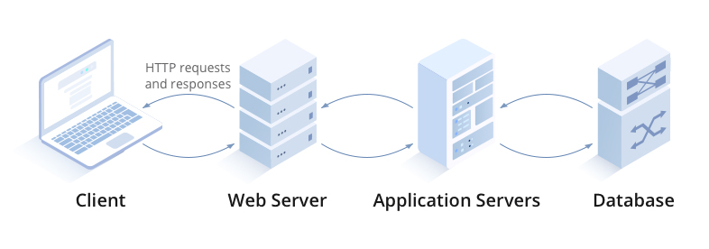
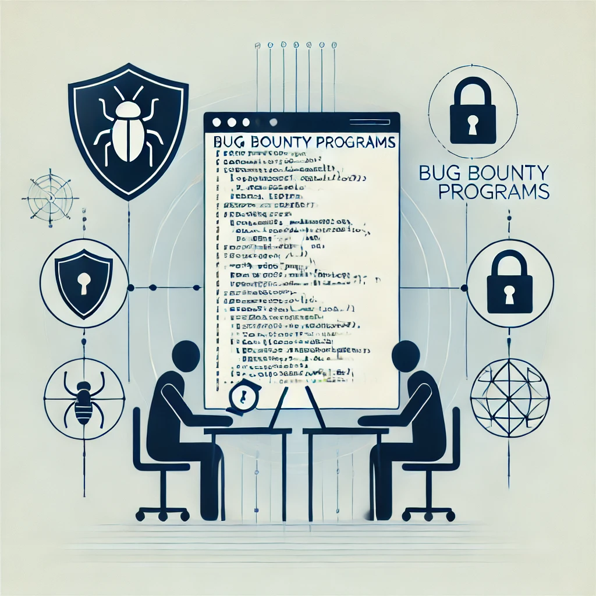

# UFCD9189
Tecnologias de Análise de Evidências

Acesso à página da ufcd: _https://cet93.github.io/UFCD9189_

---

### Web Application Security

*O que é?*

> __Web Application Security__ é o conjunto de práticas e tecnologias usadas para proteger aplicações web contra ameaças e ataques cibernéticos. Isso inclui identificar, prevenir, mitigar vulnerabilidades e outras falhas que podem ser exploradas por hackers para comprometer a segurança de sites e sistemas online.

### Web Application

*O que é?*
c
> __Web Application__ ou Aplicação Web é um software ou programa que é usado diretamente no navegador de internet, sem precisar instalar no dispositivo. Ela roda em servidores remotos e é acessada via navegador, permitindo que os usuários interajam com o programa através da web, seja para enviar e-mails, editar documentos, ou acessar dados em tempo real.

### Database Server

*O que é?*

> __Database Server__ é um servidor dedicado a armazenar, gerenciar e fornecer acesso a bancos de dados. Ele responde a solicitações de outros programas ou aplicativos, como uma aplicação web, permitindo que eles leiam ou modifiquem os dados armazenados.

### Bug Bounty Programs

*O que é?*

> __Bug Bounty Programs__ são iniciativas criadas por empresas ou organizações que recompensam hackers éticos (também conhecidos como pesquisadores de segurança) por encontrar e relatar vulnerabilidades em seus sistemas, aplicativos ou sites. Esses programas incentivam a descoberta de falhas de segurança antes que cibercriminosos as explorem, oferecendo prêmios em dinheiro ou reconhecimento público para quem identificar e reportar as vulnerabilidades de forma responsável.

### Web Application Security Risks

*O que é?*

> __Web Application Security Risks__ são ameaças e vulnerabilidades que podem comprometer a segurança de uma aplicação web, permitindo que invasores obtenham acesso não autorizado, roubem dados ou causem danos.

- SQL Injection: Quando invasores inserem comandos maliciosos em campos de entrada de dados para manipular o banco de dados.
- Cross-Site Scripting (XSS): Quando scripts maliciosos são injetados em uma página web, afetando outros usuários.
- Cross-Site Request Forgery (CSRF): Quando um atacante faz com que o usuário execute ações não intencionadas em um site no qual está autenticado.

> __Identificação__ e __Autenticação__ são dois processos relacionados à segurança em sistemas: 
> - __Identificação__ é o processo em que o usuário informa sua identidade ao sistema. É como dizer quem você é.
> - __Autenticação__ é o processo de verificar se a identidade fornecida é válida. É como provar que você é quem diz ser.

### OWASP

*O que é?*

> __OWASP (Open Web Application Security Project)__ é uma organização sem fins lucrativos que se dedica a melhorar a segurança de softwares e aplicações web. Ela fornece recursos, ferramentas, documentações e guias gratuitos para ajudar desenvolvedores, empresas e especialistas em segurança a entender e mitigar riscos de segurança cibernética.

### Access Control

*O que é?*

> __Access Control__ é o conjunto de mecanismos e políticas que definem quem pode acessar determinados recursos ou áreas de um sistema, e o que cada usuário ou grupo de usuários pode fazer. Ele garante que apenas pessoas ou sistemas autorizados tenham acesso a informações ou funcionalidades específicas.

### Injection

*O que é?*

> __Injection Attack__ ou Ataque de Injeção ocorre quando um invasor insere código malicioso em uma aplicação para manipular ou comprometer o funcionamento do sistema. Esse tipo de ataque explora falhas em entradas de dados que não validam corretamente o que é inserido, permitindo que o invasor execute comandos indesejados.

### Cryptographic

*O que é?*

> __Cryptographic__ Criptografia refere-se à ciência e prática de proteger informações e comunicações por meio da transformação de dados em um formato ilegível para qualquer pessoa que não tenha a chave correta para decodificá-los.
> O objetivo da criptografia é garantir a confidencialidade, integridade e autenticidade dos dados, protegendo-os contra acessos não autorizados.

<!-- ### HTTP/HTTPS

*O que é?*

> __HTTP__ (__Hypertext Transfer Protocol__) é um protocolo usado para comunicação entre navegadores web e servidores na Internet. Ele define como as mensagens são formatadas e transmitidas, permitindo a comunicação entre os navegadores e os servidores.
> HTTPS (Hypertext Transfer Protocol Secure) é a versão segura do HTTP, usada para garantir a proteção das comunicações entre o navegador e o servidor. Ele utiliza criptografia, geralmente com o protocolo SSL (Secure Sockets Layer) ou TLS (Transport Layer Security), para proteger os dados transmitidos.

### SSL/TLS

*O que é?*

> __SSL__ (__Secure Sockets Layer__) é um protocolo que criptografa a comunicação entre navegadores e servidores, garantindo que os dados transmitidos sejam protegidos contra interceptação. Embora tenha sido substituído pelo __TLS__ (Transport Layer Security), o termo ainda é usado para descrever conexões seguras, como no __HTTPS__.

> __TLS__ (__Transport Layer Security__) é um protocolo de segurança que criptografa a comunicação entre navegadores e servidores, garantindo a privacidade e integridade dos dados transmitidos. Ele é a versão mais atualizada e segura do SSL.

__TLS__ substituiu o __SSL__ porque o SSL apresentava vulnerabilidades de segurança que tornavam suas versões menos seguras contra ataques modernos.
- TLS usa algoritmos de criptografia, mecanismos de segurança mais fortes e, é mais resistente a ataques.
- O processo de negociação da conexão é mais seguro e eficiente no TLS.

oi -->

<!-- du/dt = a*d^2u/dx^2

Bachelier's model
thorpe equation

 _
l l = V-AS (rate of return, r = risk-free rate)

Black-Scholes Merton Equation

Hidden Markov models

t = -ln(r) / ln(1 + r)
(P * (1 + r)^t) * r = P -->
