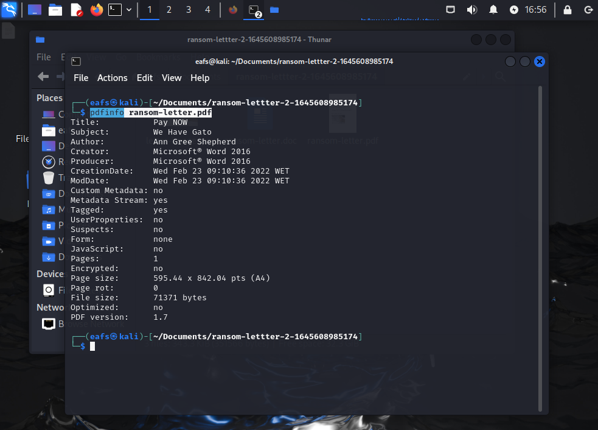
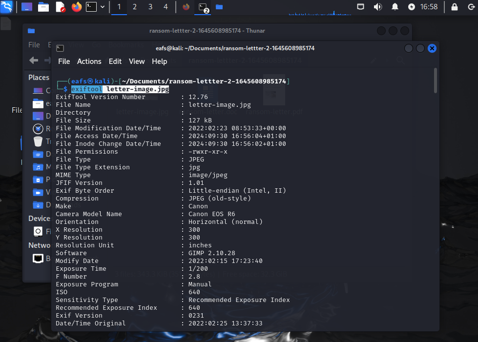

# UFCD9189
Tecnologias de Análise de Evidências

Acesso à página da ufcd: _https://cet93.github.io/UFCD9189_

---

## __Web Application Security__

### Web Application Security

*O que é?*

> __Web Application Security__ é o conjunto de práticas e tecnologias usadas para proteger aplicações web contra ameaças e ataques cibernéticos. Isso inclui identificar, prevenir, mitigar vulnerabilidades e outras falhas que podem ser exploradas por hackers para comprometer a segurança de sites e sistemas online.

### Web Application

*O que é?*
c
> __Web Application__ ou Aplicação Web é um software ou programa que é usado diretamente no navegador de internet, sem precisar instalar no dispositivo. Ela roda em servidores remotos e é acessada via navegador, permitindo que os usuários interajam com o programa através da web, seja para enviar e-mails, editar documentos, ou acessar dados em tempo real.

### Database Server

*O que é?*

> __Database Server__ é um servidor dedicado a armazenar, gerenciar e fornecer acesso a bancos de dados. Ele responde a solicitações de outros programas ou aplicativos, como uma aplicação web, permitindo que eles leiam ou modifiquem os dados armazenados.

### Bug Bounty Programs

*O que é?*

> __Bug Bounty Programs__ são iniciativas criadas por empresas ou organizações que recompensam hackers éticos (também conhecidos como pesquisadores de segurança) por encontrar e relatar vulnerabilidades em seus sistemas, aplicativos ou sites. Esses programas incentivam a descoberta de falhas de segurança antes que cibercriminosos as explorem, oferecendo prêmios em dinheiro ou reconhecimento público para quem identificar e reportar as vulnerabilidades de forma responsável.

### Web Application Security Risks

*O que é?*

> __Web Application Security Risks__ são ameaças e vulnerabilidades que podem comprometer a segurança de uma aplicação web, permitindo que invasores obtenham acesso não autorizado, roubem dados ou causem danos.

- SQL Injection: Quando invasores inserem comandos maliciosos em campos de entrada de dados para manipular o banco de dados.
- Cross-Site Scripting (XSS): Quando scripts maliciosos são injetados em uma página web, afetando outros usuários.
- Cross-Site Request Forgery (CSRF): Quando um atacante faz com que o usuário execute ações não intencionadas em um site no qual está autenticado.

> __Identificação__ e __Autenticação__ são dois processos relacionados à segurança em sistemas: 
> - __Identificação__ é o processo em que o usuário informa sua identidade ao sistema. É como dizer quem você é.
> - __Autenticação__ é o processo de verificar se a identidade fornecida é válida. É como provar que você é quem diz ser.

### OWASP

*O que é?*

> __OWASP (Open Web Application Security Project)__ é uma organização sem fins lucrativos que se dedica a melhorar a segurança de softwares e aplicações web. Ela fornece recursos, ferramentas, documentações e guias gratuitos para ajudar desenvolvedores, empresas e especialistas em segurança a entender e mitigar riscos de segurança cibernética.

### Access Control

*O que é?*

> __Access Control__ é o conjunto de mecanismos e políticas que definem quem pode acessar determinados recursos ou áreas de um sistema, e o que cada usuário ou grupo de usuários pode fazer. Ele garante que apenas pessoas ou sistemas autorizados tenham acesso a informações ou funcionalidades específicas.

### Injection

*O que é?*

> __Injection Attack__ ou Ataque de Injeção ocorre quando um invasor insere código malicioso em uma aplicação para manipular ou comprometer o funcionamento do sistema. Esse tipo de ataque explora falhas em entradas de dados que não validam corretamente o que é inserido, permitindo que o invasor execute comandos indesejados.

### Cryptographic

*O que é?*

> __Cryptographic__ Criptografia refere-se à ciência e prática de proteger informações e comunicações por meio da transformação de dados em um formato ilegível para qualquer pessoa que não tenha a chave correta para decodificá-los.
> O objetivo da criptografia é garantir a confidencialidade, integridade e autenticidade dos dados, protegendo-os contra acessos não autorizados.

### HTTP/HTTPS

*O que é?*

> __HTTP__ (__Hypertext Transfer Protocol__) é um protocolo usado para comunicação entre navegadores web e servidores na Internet. Ele define como as mensagens são formatadas e transmitidas, permitindo a comunicação entre os navegadores e os servidores.
> HTTPS (Hypertext Transfer Protocol Secure) é a versão segura do HTTP, usada para garantir a proteção das comunicações entre o navegador e o servidor. Ele utiliza criptografia, geralmente com o protocolo SSL (Secure Sockets Layer) ou TLS (Transport Layer Security), para proteger os dados transmitidos.

### SSL/TLS

*O que é?*

> __SSL__ (__Secure Sockets Layer__) é um protocolo que criptografa a comunicação entre navegadores e servidores, garantindo que os dados transmitidos sejam protegidos contra interceptação. Embora tenha sido substituído pelo __TLS__ (Transport Layer Security), o termo ainda é usado para descrever conexões seguras, como no __HTTPS__.

> __TLS__ (__Transport Layer Security__) é um protocolo de segurança que criptografa a comunicação entre navegadores e servidores, garantindo a privacidade e integridade dos dados transmitidos. Ele é a versão mais atualizada e segura do SSL.

__TLS__ substituiu o __SSL__ porque o SSL apresentava vulnerabilidades de segurança que tornavam suas versões menos seguras contra ataques modernos.
- TLS usa algoritmos de criptografia, mecanismos de segurança mais fortes e, é mais resistente a ataques.
- O processo de negociação da conexão é mais seguro e eficiente no TLS.

### Insecure Direct Object References (IDOR)

*O que é?*

> __IDOR__ é uma vulnerabilidade que ocorre quando uma aplicação permite que usuários acessem diretamente recursos, modificando identificadores em URLs ou parâmetros, sem validação de permissão, possibilitando o acesso a dados de outros usuários de forma indevida.

_Imagine que você tem um armário na escola, e cada aluno tem uma chave com o número do armário. Se a escola não prestar atenção, pode ser que qualquer aluno, com a mesma chave, consiga abrir outros armários apenas mudando o número. No mundo digital, o __IDOR__ é como se você pudesse mudar o número na chave e acessar as coisas dos outros, sem permissão._

---
---
---

## __Intro to Digital Forensics__

> Digital Forensics ou Forense Digital refere-se à coleta, análise e preservação de evidências digitais para entender como um ataque aconteceu e identificar os responsáveis. Imagine que aconteceu um roubo em uma casa. A Forense Digital é como a investigação que busca pistas, como pegadas ou digitais, para descobrir quem fez o roubo e como aconteceu.

Forense Digital possui dois tipos de investigações:

- __Public-sector investigations__ referem-se a investigações conduzidas por agências governamentais ou entidades públicas. Essas investigações geralmente envolvem crimes que afetam o interesse público; _crimes cibernéticos_, _fraude_, _terrorismo_, _espionagem_.

- __Private-sector investigations__ são investigações conduzidas por empresas ou entidades privadas para proteger seus próprios interesses. Envolve a coleta e análise de evidências digitais para resolver questões internas; _fraude corporativa_, _violação de políticas internas_, _roubo de propriedade intelectual_, _investigações de incidentes de segurança_, _vazamento de dados_.

> __pdfinfo__ é uma ferramenta de linha de comando que faz parte do pacote __Poppler__ e é usada para extrair informações de arquivos PDF. Ele exibe detalhes como o título do documento, autor, número de páginas, tamanho da página, data de criação, e versão do PDF.

Em __Kali Linux__ se o pacote __Poppler__ estiver indisponível, segue o comando para instalação do mesmo: `apt install poppler-utils`

- Comando de uso: `pdfinfo caminho/nomeArquivo.pdf`

> __exiftool__ é uma ferramenta de linha de comando usada para ler, escrever e editar metadados de diversos tipos de arquivos.

Em __Kali Linux__ se o pacote __libimage-exiftool-perl__ estiver indisponível, segue o comando para instalação do mesmo: `apt install libimage-exiftool-perl`

- Comando de uso: `exiftool caminho/nomeArquivo.png`

---
---
---

## __Como a Web Funciona__

> __DNS__: _Domain Name System_ é o sistema que traduz nomes de domínio legíveis (como www.exemplo.com) em endereços IP numéricos (como 192.168.1.1) que os computadores usam para se comunicar entre si, funciona como uma "agenda telefônica" da internet.

> __Root Domain__: Domínio Raiz refere-se ao ponto mais alto da hierarquia de nomes de domínio no sistema DNS, representado por um ponto (.) e normalmente não aparece nas URLs.

> __TLD__: Top-Level Domain é a parte final de um nome de domínio na internet (.br, .com, .gov).

> __Second-Level Domain__: representa o nome único escolhido por uma entidade (github, kali, tryhackme).

> __Subdomain__: é uma parte adicional de um nome de domínio, usado para organizar diferentes seções de um site ou serviço ("mail" em mail.google.com).

> Hierarquia:\
> __Root Domain__ (.) – no topo.\
> __Top-Level Domain__ (TLD) – como .com ou .org.\
> __Second-Level Domain__ – como google em google.com.\
> __Subdomains__ – como mail em mail.google.com.

Tamanho máximo para o _subdomain_ são 63 caracteres, e para o _domain name_ 253 caracteres.

__DNS Record Types__:

> Os tipos de registros DNS Record Types são diferentes entradas usadas para armazenar informações específicas sobre domínios e seu comportamento.

> __A (Address Record)__: Mapeia um nome de domínio para um endereço IPv4; `exemplo.com.   3600   IN   A   192.168.1.1`\
> __AAAA (IPv6 Address Record)__: Mapeia um nome de domínio para um endereço IPv6; `exemplo.com.   3600   IN   AAAA   2001:0db8:85a3:0000:0000:8a2e:0370:7334`\
> __CNAME (Canonical Name Record)__: Define um domínio como um alias para outro; `www.exemplo.com.   3600   IN   CNAME   exemplo.com.`\
> __MX (Mail Exchange Record)__: Indica os servidores de e-mail responsáveis por receber e-mails para o domínio; `exemplo.com.   3600   IN   MX   10 mail.exemplo.com.`\
> __NS (Name Server Record)__: Especifica os servidores DNS que são responsáveis pela zona de um domínio; `exemplo.com.   3600   IN   NS   ns1.exemplo.com.`\
> __PTR (Pointer Record)__: Usado para consultas reversas, mapeando um IP para um nome de domínio; `1.1.168.192.in-addr.arpa.   3600   IN   PTR   exemplo.com.`\
> __TXT (Text Record)__: Armazena informações de texto, muitas vezes usadas para verificação de domínios e políticas de segurança; `exemplo.com.   3600   IN   TXT   "v=spf1 include:_spf.exemplo.com ~all"`\
> __SOA (Start of Authority Record)__: Contém informações sobre a zona DNS, como o servidor principal e o controle de atualização; `exemplo.com.   3600   IN   SOA   ns1.exemplo.com. admin.exemplo.com. 2023091001 7200 3600 1209600 86400`

__O que Acontece quando se faz uma requisição DNS__:

> 1. Verificação do cache local (DNS Resolver Cache):\
> - O sistema operacional verifica se o nome de domínio já está armazenado em cache localmente. Esse cache contém endereços IP de consultas DNS anteriores. Se o endereço IP do domínio solicitado estiver no cache, o processo termina aqui e o navegador usa esse IP para contatar o servidor.\
> - Se o cache local não tiver a informação, a solicitação continua.

> 2. Consulta ao servidor DNS Recursivo (ou Resolver):\
> - Se o cache local não tiver o resultado, o dispositivo faz uma solicitação ao servidor DNS recursivo configurado, fornecidos pelo ISP ou um DNS público.\
> - O servidor DNS recursivo tem a função de procurar a resposta em seu próprio cache ou realizar a consulta a outros servidores DNS se necessário.

> 3. Verificação no cache do servidor DNS recursivo:\
> - O servidor DNS recursivo verifica se ele já tem o IP do domínio solicitado armazenado em seu cache. Se sim, ele envia a resposta de volta para o dispositivo.\
> - Se não tiver a resposta, ele inicia o processo de consulta a outros servidores DNS.

> 4. Consulta aos servidores DNS raiz (Root Servers):\
> - Se o servidor recursivo não encontrar a resposta em seu cache, ele faz uma consulta aos servidores DNS raiz. Esses servidores são o ponto de partida para a resolução de nomes de domínio e contêm informações sobre os servidores de Top-Level Domain.\
> - O servidor raiz não conhece o endereço IP do domínio exato, mas sabe qual servidor DNS gerencia o TLD da solicitação.

> 5. Consulta ao servidor TLD:\
> - O servidor DNS recursivo, agora ciente do servidor que gerencia o TLD do domínio, faz uma nova consulta a esse servidor TLD.\
> - O servidor TLD não sabe o endereço IP, mas sabe qual é o servidor autoritativo para o domínio.

> 6. Consulta ao servidor autoritativo:\
> - O servidor DNS recursivo agora consulta o servidor DNS autoritativo para o domínio. O servidor autoritativo é o que contém o registro DNS oficial para o domínio, incluindo o endereço IP (registro A) associado ao domínio.\
> - O servidor autoritativo responde com o endereço IP correto.

> 7. Retorno da resposta ao dispositivo solicitante:\
> - O servidor DNS recursivo retorna o endereço IP ao dispositivo que fez a solicitação original. O dispositivo então armazena essa informação no cache local para futuras consultas.

> 8. Conexão ao servidor web:\
> - Agora que o dispositivo tem o endereço IP do domínio, ele pode se conectar diretamente ao servidor usando o protocolo HTTP ou HTTPS. O navegador faz uma solicitação ao endereço IP correspondente e exibe o site ao usuário. 

__1. Cache local → 2. Servidor DNS recursivo → 3. Servidor Root → 4. Servidor TLD → 5. Servidor Autoritativo → 6. Resposta ao cliente → 7. Conexão ao servidor web.__

<!-- du/dt = a*d^2u/dx^2

Bachelier's model
thorpe equation

 _
l l = V-AS (rate of return, r = risk-free rate)

Black-Scholes Merton Equation

Hidden Markov models

t = -ln(r) / ln(1 + r)
(P * (1 + r)^t) * r = P -->

